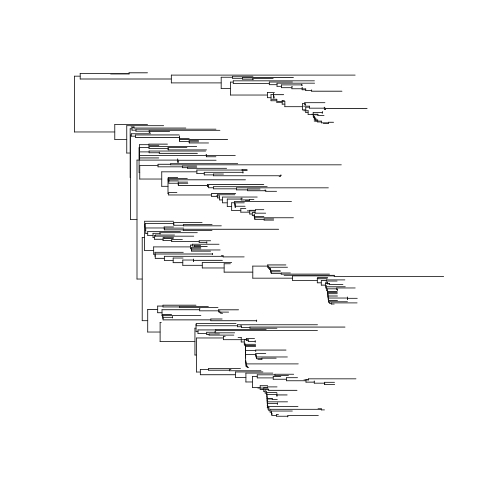

# Exploratory phylodynamics of early EBOV epidemic in Sierra Leone

In this practical, we will analyse some of the first whole-genome EBOV sequences collected during the Spring/Summer 2014 epidemic in Western Africa. The data are described here: 

* [Rates of evolution in the 2014/2015 West African ebolavirus outbreak](http://epidemic.bio.ed.ac.uk/ebolavirus_evolutionary_rates)

By the way, here is an interesting TED talk by the chief scientist responsible for collecting the data: 

* [P Sabeti: How we'll fight the next deadly virus](https://www.ted.com/talks/pardis_sabeti_how_we_ll_fight_the_next_deadly_virus?language=en)

## Installation and setup
For these analyses, we'll use the `phydynR` and `INLA` packages. If you need to install this on MS Windows, run the installation script like this:
```
source('msc_epi_ebola_installScript.R')
```
On Mac or Linux, we will need to compile the package from source, which will take a bit longer:
```
install.packages('devtools')
require(devtools)
install_github( 'emvolz-phylodynamics/phydynR')
install.packages('INLA', repos="http://www.math.ntnu.no/inla/R/stable")
```

Now we load the package as follows:

```r
suppressPackageStartupMessages( require(phydynR) )
```

## Loading and exploring the data
Let's load the multiple sequence alignment and inspect it:

```r
ebov_algn <- read.dna('ebov_panafr_082014.fasta', format = 'fasta' ) 
ebov_algn
```

```
## 121 DNA sequences in binary format stored in a matrix.
## 
## All sequences of same length: 18961 
## 
## Labels: EBOV|KC242801|deRoover|DRC|1976 EBOV|KC242800|Ilembe|Gabon|2002 EBOV|KC242799|13709|Kikwit_DRC|1995 EBOV|KC242798|1Ikot|Gabon|1996 EBOV|KC242797|1Oba|Gabon|1996 EBOV|KC242796|13625|Kikwit_DRC|1995 ...
## 
## More than 1 million nucleotides: not printing base composition
```
It's always a good idea to visually check your alignment, which is most easily done using an external tool like *seaview*.
Note that this alignment includes many sequences from previous EBOV epidemics in addition to the 2014 West African epidemic, and that many of the older sequences are not whole-genomes. Also note that the sequence labels include both the place and time of sampling, and we will need to extract that information. 

Let's compute genetic and evolutionary distances between sequences. This computes the raw number of character differences between each pair of sequences: 

```r
Draw <- dist.dna( ebov_algn, model = 'raw' , as.matrix = T, pairwise.deletion=TRUE) * ncol(ebov_algn )
```
Note the option `pairwise.deletion=TRUE`, which causes missing data to be handled on a pairwise basis as opposed to masking sites across the entire alignment. We can also take a subset of distances from the Sierra Leone samples:

```r
Draw_sl <- Draw[grepl( 'SierraLeone_G',  rownames(Draw)), grepl( 'SierraLeone_G',  rownames(Draw)) ]
diag(Draw_sl) <- NA # don't count zero distances on diagonal
hist(Draw_sl)
```

 
Here we see that there is very little diversity in the SL data, with many pairs differing by less than two characters, which is due to the short time frame over which the epidemic spread and over which samples were collected.


## A quick phylogenetic analysis and estimation of evolutionary rates
First, we will compute an evolutionary distance matrix for phylogenetic analysis. We will use the *F84* [nucleotide substition model](https://en.wikipedia.org/wiki/Models_of_DNA_evolution), which is similar to the HKY model that several published studies have found to work well for EBOV. 

```r
D <- dist.dna( ebov_algn, model = 'F84', pairwise.deletion=TRUE)
```
Now computing a neighbor-joining tree is as simple as the following command: 

```r
ebov_nj <- nj( D )
ebov_nj
```

```
## 
## Phylogenetic tree with 121 tips and 119 internal nodes.
## 
## Tip labels:
## 	EBOV|KC242801|deRoover|DRC|1976, EBOV|KC242800|Ilembe|Gabon|2002, EBOV|KC242799|13709|Kikwit_DRC|1995, EBOV|KC242798|1Ikot|Gabon|1996, EBOV|KC242797|1Oba|Gabon|1996, EBOV|KC242796|13625|Kikwit_DRC|1995, ...
## 
## Unrooted; includes branch lengths.
```
Let's plot it: 

```r
plot( ladderize(ebov_nj) , cex = .5) 
```

 
Note that there is no sigfinicance to the location of the root of this tree, and branch lengths show distances in units of substitions per site. Note the large cluster involving sequences from Sierra Leone. 

To fit a molecular clock, we must use information about the time of each sample. 
Let's load the date of sampling for sequence, which is found in the following table:

```r
sampleDates_table <- read.csv( 'ebov_sampleDates.csv' ) 
sampleDates <- setNames( sampleDates_table$year, sampleDates_table[,1]) # we will also need this in vector format
```
Note that most of the samples come from the most recent epidemic:

```r
hist( sampleDates )
```

 

Now we can construct a time-aware phylogenetic tree. Let's start by placing the root of the tree on a branch that is likely to have the MRCA of the sample. One way to do this is to use the `rtt` command, which uses root-to-tip regression; this selects the root position to maximise the variance in evolutionary distance explained by the tree. 

```r
reroot_ebov_nj <- rtt( ebov_nj, sampleDates )
plot( ladderize(reroot_ebov_nj) , cex = .5)
```

 

Lets do our own root-to-tip regression using the rerooted tree. This will also give us a rough estimate of the molecular clock rate.


```r
n <- nrow(ebov_algn ) # the sample size 
d2root <- dist.nodes( reroot_ebov_nj )[n+1,1:n] # the distance from the root to each tip 
scatter.smooth ( sampleDates, d2root ) # a scatter plot with local regression line
```

 
Finally,we do a linear regression:

```r
summary( lm( d2root ~ sampleDates ) )
```

```
## 
## Call:
## lm(formula = d2root ~ sampleDates)
## 
## Residuals:
##        Min         1Q     Median         3Q        Max 
## -0.0036370  0.0001515  0.0002889  0.0003352  0.0052707 
## 
## Coefficients:
##               Estimate Std. Error t value Pr(>|t|)    
## (Intercept) -1.621e+00  2.906e-02  -55.78   <2e-16 ***
## sampleDates  8.201e-04  1.446e-05   56.70   <2e-16 ***
## ---
## Signif. codes:  0 '***' 0.001 '**' 0.01 '*' 0.05 '.' 0.1 ' ' 1
## 
## Residual standard error: 0.001327 on 119 degrees of freedom
## Multiple R-squared:  0.9643,	Adjusted R-squared:  0.964 
## F-statistic:  3215 on 1 and 119 DF,  p-value: < 2.2e-16
```
Specifically, the molecular clock rate is the slope:

```r
coef( lm( d2root ~ sampleDates ) )['sampleDates']
```

```
##  sampleDates 
## 0.0008200608
```
This value is not very accurate, but it's in the right ball-park. Estimates based on the state-of-the-art [Bayesian methods](http://epidemic.bio.ed.ac.uk/ebolavirus_evolutionary_rates) place the rate at around `.00124` substitions per site per year.


## Estimating times of common ancestry 
To estimate a tree with branch lengths in units of time (and TMRCAs), we will need to use algorithms not (yet) included in R. We'll use a fast and accurate heuristic method known as [least-squares-dating]()
We run this from the command line as follows: 
```
lsd -i [input tree file name] -d [sample date file name] -o [output file name] -c -r a -s [sequence length]
```
The `-c` option ensures that the tree has only positive branch lengths, and `-r a` examines all branches in the tree as potential sites for the root. `-s` specifies the sequence length, which we have seen from the alignment. 
I have precomputed the results; you can load the time-scaled tree like so:

```r
lsdtree <- read.tree('ebov_lsdtree.nwk')
plot( ladderize(lsdtree), cex = .6 ) 
```

 
We shall also want a version of this tree with all samples from outside Sierra Leone excluded; this is because we will estimate dynamics in Sierra Leone, and the models will not fit data from outside of that epidemic. We create the SL subtree like so: 

```r
non_sl_samples <- lsdtree$tip.label[ !grepl( 'SierraLeone_G',  lsdtree$tip.label) ] # samples from outside SL
sl_lsdtree <- drop.tip ( lsdtree, non_sl_samples )  # the SL subtree
sl_lsdtree$edge.length <- pmax( 0, sl_lsdtree$edge.length ) # fix any negative bl's
sl_sampleTimes <- sampleDates[ sl_lsdtree$tip.label ] # the sample times just for the SL tree
plot( ladderize( sl_lsdtree ), cex = .7 )
```

 


## Nonparametric phylodynamic estimation 
We will reconstruct the historical dynamics of Ne(t) using the nonparametric skyride technique. This implementation of the skyride model is due to [Simon Frost](http://www.infectiousdisease.cam.ac.uk/directory/sdf22@cam.ac.uk), and another example applied to Lassa virus [can be found here](https://github.com/sdwfrost/exploratory-phylodynamics). 

```r
source('skyride.R') # load skyride model
sk <- calculate.heterochronous.skyride( sl_lsdtree ) # just for the SL subtree
```

```r
head(sk)
```

```
##         time sr.median     sr.lc     sr.uc
## 1 0.01047950  9.234598 36.722180 3.3725008
## 2 0.01195890  2.897100  9.250116 1.0625556
## 3 0.01295890  2.228720  6.555603 0.8590725
## 4 0.01321923  1.987580  5.798279 0.7472791
## 5 0.01406541  1.914037  5.513480 0.7363874
## 6 0.01421923  1.906776  5.577032 0.7035862
```
This generates a table of times and Ne estimates. Let's plot the trajectory and credible intervals:

```r
matplot( max(sl_sampleTimes ) - sk$time # show time axis relative to last sample
 , sk[2:4]
 , type = 'l' , log = 'y', col = 'black' , lty = c(1, 2, 2 )
 , xlab = 'Time', ylab = 'Ne(t)' )
```

 
Note the logarithmic y-axis. We see evidence for early exponential growth following by possible decreasing growth rates.


## Phylodynamic estimates using an SIR model 
Let's fit a simple exponential growth epidemic model of the form
```
d/dt I = beta I - gamma I
```
where beta is the transmission rate and gamma is the removal rate. Note that `R0 = beta / gamma`. 
To do this, we build the model by specifying rate equations for births ('transmissions') and deaths: 

```r
births <- c( I = 'parms$beta * I' )
deaths <- c( I = 'parms$gamma * I' )
ebov_model1 <- build.demographic.process(births=births
  , deaths = deaths
  , parameterNames=c('beta', 'gamma') 
  , rcpp=FALSE # specifies that equations are R-code as opposed to C-code
)
```
We will fix `gamma` based on independent estimates. For example, [this study](http://www.ncbi.nlm.nih.gov/pmc/articles/PMC4235004/) found a serial interval of 15 days, so we will use that value after adjusting rates from days to years:

```r
GAMMA <- 365 / 15
```
In a moment, we will estimate `beta` and an initial conditions parameter. First, lets specify starting conditions, and plot a hypothetical trajectory:

```r
t0 <- 2014 # hypothetical start time of SL epidemic
theta_start <- c( beta = 2 * GAMMA, gamma = GAMMA) # starting conditions for maximum likelihood
I0 <- .1 # initial number infected
show.demographic.process( ebov_model1
 , theta = theta_start
 , x0  = c( I = I0 )
 , t0 = t0
 , t1 = max(sl_sampleTimes)
) 
```

 
Now, it is simple to fit the model by maximum likelihood:

```r
# first apply sample times to phylo:
sl_lsdtree <- DatedTree( sl_lsdtree, sampleTimes = sl_sampleTimes, tol = Inf, minEdgeLength = 1e-3 ) 
fit <- optim.colik(sl_lsdtree
  , ebov_model1
  , start = c( theta_start, I=I0 ) # the starting conditions for optimisation
  , est_pars = c( 'beta', 'I') # the parameters to be estimated
  , ic_pars = c('I') # the initial conditions
  , t0 = 2014 # the time of epidemic origin (could also be estimated)
  , parm_lowerBounds = c( I = 0, beta = 0) # lower limits for parameter values (can't have negative rates)
) 
```

```
##     beta        I 
## 48.66667  0.10000 
##     beta        I 
## 53.53333  0.10000 
##      beta         I 
## 48.666667  4.966667 
##      beta         I 
## 49.883333  2.533333 
##      beta         I 
## 50.491667  1.316667 
##       beta          I 
## 50.7958333  0.7083333 
##       beta          I 
## 50.9479167  0.4041667 
##       beta          I 
## 51.0239583  0.2520833 
##       beta          I 
## 46.1572917  0.2520833 
##      beta         I 
## 42.469271  0.328125 
##       beta          I 
## 40.1119792  0.1760417 
##       beta          I 
## 34.6559896  0.1380208 
##       beta          I 
## 33.9145833  0.4041667 
##       beta          I 
## 44.9786458  0.1760417 
##      beta         I 
## 37.602604  0.328125 
##       beta          I 
## 33.9145833  0.4041667 
##       beta          I 
## 35.2453125  0.1760417 
##       beta          I 
## 40.6632812  0.2901042 
##       beta          I 
## 37.0513021  0.2140625 
##       beta          I 
## 39.7602865  0.2710938 
##       beta          I 
## 37.9542969  0.2330729 
##       beta          I 
## 37.0513021  0.2140625 
##       beta          I 
## 35.4449219  0.3851562 
##       beta          I 
## 38.9452148  0.2283203 
##       beta          I 
## 36.6116862  0.3328776 
##       beta          I 
## 37.1950684  0.3067383 
##       beta          I 
## 36.9633789  0.2378255 
##       beta          I 
## 37.4427979  0.3055501 
##       beta          I 
## 37.1231852  0.2604004 
##       beta          I 
## 37.3628947  0.2942627 
##       beta          I 
## 37.2030884  0.2716878 
##       beta          I 
## 37.1231852  0.2604004 
##       beta          I 
## 38.5456991  0.1718831 
##       beta          I 
## 39.5127055  0.0913859 
##      beta         I 
## 37.794491  0.210498 
##       beta          I 
## 37.8344421  0.2161418 
##       beta          I 
## 39.1371012  0.1106934 
##       beta          I 
## 37.6865916  0.2314392 
##      beta         I 
## 38.653598  0.150942 
##       beta          I 
## 39.1371012  0.1106934 
##       beta          I 
## 39.4048065  0.1123271 
##        beta           I 
## 40.20996450  0.06324158 
##       beta          I 
## 39.5127055  0.0913859 
##       beta          I 
## 38.7874507  0.1517588 
##       beta          I 
## 39.2709539  0.1115102 
##       beta          I 
## 38.9083265  0.1416967 
##       beta          I 
## 39.6595350  0.1030818 
##        beta           I 
## 40.16250343  0.07915166 
##        beta           I 
## 40.15601501  0.07371216 
##       beta          I 
## 39.2202486  0.1247005 
##        beta           I 
## 39.84409288  0.09070829 
##        beta           I 
## 40.15601501  0.07371216 
##        beta           I 
## 40.09882132  0.08146299 
##        beta           I 
## 40.44582872  0.06603095 
##        beta           I 
## 40.28337924  0.06908951 
##       beta          I 
## 39.8154960  0.0945837 
##       beta          I 
## 40.0702245  0.0853384 
##        beta           I 
## 40.18329027  0.08265346 
##        beta           I 
## 40.46661557  0.06953274 
##        beta           I 
## 39.97827591  0.08832096 
##        beta           I 
## 40.30383568  0.07579548 
##        beta           I 
## 40.46661557  0.06953274 
##        beta           I 
## 40.38830463  0.07698596 
##        beta           I 
## 40.53304629  0.07474744 
##        beta           I 
## 40.65359170  0.06788946 
##        beta           I 
## 40.88874241  0.06050747 
##        beta           I 
## 41.11795302  0.05945942 
##        beta           I 
## 41.52501169  0.05129139 
##        beta           I 
## 41.88070781  0.03705142 
##        beta           I 
## 40.86996167  0.06532343 
##        beta           I 
## 41.50623095  0.05610736 
##        beta           I 
## 41.35185881  0.05720739 
##        beta           I 
## 42.00690883  0.04317534 
##       beta          I 
## 42.5753824  0.0321013 
##       beta          I 
## 42.7485353  0.0261853 
##        beta           I 
## 41.70102793  0.04945187 
##        beta           I 
## 42.75139866  0.03026177 
##        beta           I 
## 43.36459214  0.01974696 
##       beta          I 
## 43.6257531  0.0129112 
##       beta          I 
## 42.1822092  0.0403167 
##        beta           I 
## 43.14457183  0.02204637 
##        beta           I 
## 42.42279988  0.03574912 
##        beta           I 
## 42.90398118  0.02661395 
##        beta           I 
## 42.54309521  0.03346533 
##       beta          I 
## 42.7191115  0.0316258 
##        beta           I 
## 42.68317919  0.03174467 
##        beta           I 
## 42.92741490  0.02842225 
##       beta          I 
## 43.1195747  0.0259007 
##        beta           I 
## 43.15186195  0.02453668 
##        beta           I 
## 43.04367432  0.02630896 
##        beta           I 
## 43.41185041  0.02194789 
##       beta          I 
## 42.9165116  0.0281833 
##        beta           I 
## 43.24673747  0.02402636 
##        beta           I 
## 43.41185041  0.02194789 
##        beta           I 
## 43.32263789  0.02361811 
##        beta           I 
## 43.46211968  0.02227268 
##        beta           I 
## 43.58928241  0.02039834 
##        beta           I 
## 43.23700166  0.02452511 
##        beta           I 
## 43.45238387  0.02277144 
##        beta           I 
## 43.55520706  0.02214397 
##        beta           I 
## 43.78032508  0.01989154 
##        beta           I 
## 44.05198679  0.01757476 
##        beta           I 
## 44.14507418  0.01744605 
##        beta           I 
## 44.48655142  0.01503273 
##        beta           I 
## 44.98333115  0.01046352 
##        beta           I 
## 43.91223809  0.01922386 
##        beta           I 
## 44.34680272  0.01668184 
##        beta           I 
## 44.27309874  0.01690507 
##        beta           I 
## 44.92111605  0.01249071 
##        beta           I 
## 44.16445758  0.01754057 
##      beta         I 
## 44.668897  0.014174 
##        beta           I 
## 44.92111605  0.01249071 
##       beta          I 
## 44.8086453  0.0125249 
##       beta          I 
## 44.4622634  0.0156426 
##        beta           I 
## 44.64460849  0.01478386 
##        beta           I 
## 44.72363703  0.01465943 
##        beta           I 
## 44.93027024  0.01319082 
##        beta           I 
## 45.16427368  0.01196493 
##        beta           I 
## 45.21901414  0.01245036 
##        beta           I 
## 45.49407293  0.01158855 
##         beta            I 
## 45.934709582  0.008894056 
##        beta           I 
## 46.54024586  0.00601137 
##         beta            I 
## 46.264508839  0.008517669 
##         beta            I 
## 46.814626420  0.006794037 
##         beta            I 
## 47.255263069  0.004099544 
##         beta            I 
## 45.934370468  0.009716297 
##         beta            I 
## 46.814965535  0.005971795 
##         beta            I 
## 46.154519235  0.008780172 
##         beta            I 
## 47.034436072  0.006680152 
##         beta            I 
## 46.759504450  0.007233628 
##         beta            I 
## 47.694543258  0.004694017 
##        beta           I 
## 48.46455527  0.00265094 
##         beta            I 
## 47.474733606  0.004807901 
##         beta            I 
## 47.364659222  0.005275964 
##         beta            I 
## 48.354650444  0.002707882 
##         beta            I 
## 47.199632426  0.005772498 
##         beta            I 
## 47.969644438  0.003729421 
##         beta            I 
## 47.392135429  0.005261729 
##         beta            I 
## 47.611945081  0.005147845 
##         beta            I 
## 47.509036475  0.004892887 
##         beta            I 
## 47.811444304  0.004325176 
##       beta          I 
## 48.0210987  0.0038569 
##        beta           I 
## 48.20660552  0.00365803 
##         beta            I 
## 48.555390049  0.003040601 
##         beta            I 
## 48.533161007  0.002820912 
##         beta            I 
## 47.904197695  0.004225741 
##         beta            I 
## 48.089704479  0.004026871 
##         beta            I 
## 48.072553044  0.003984378 
##         beta            I 
## 48.374960873  0.003416667 
##        beta           I 
## 48.61034246  0.00301213 
##         beta            I 
## 48.509013353  0.003090318 
##         beta            I 
## 48.181668121  0.003760863 
##         beta            I 
## 48.350023470  0.003519501 
##         beta            I 
## 48.421732443  0.003450236 
##        beta           I 
## 48.61502519  0.00310604 
##         beta            I 
## 48.831703732  0.002778628 
##         beta            I 
## 48.661796765  0.003139609 
##         beta            I 
## 48.805214711  0.003001079 
##         beta            I 
## 48.998507463  0.002656883 
##         beta            I 
## 48.565926198  0.003251898 
##         beta            I 
## 48.756115714  0.003146938 
##         beta            I 
## 48.720843085  0.003136713 
##         beta            I 
## 48.995404227  0.002896119 
##        beta           I 
## 49.21014324  0.00271823 
##         beta            I 
## 49.259242239  0.002572372 
##         beta            I 
## 49.510805501  0.002285089 
##        beta           I 
## 49.91573403  0.00200224 
##        beta           I 
## 50.47099369  0.00150282 
##         beta            I 
## 50.216396291  0.001569099 
##         beta            I 
## 49.461706504  0.002430947 
##         beta            I 
## 49.964833029  0.001856381 
##         beta            I 
## 49.839051398  0.002000023 
##         beta            I 
## 50.369761560  0.001573532 
##       beta          I 
## 49.7255445  0.0021072 
##         beta            I 
## 50.155022545  0.001751421 
##         beta            I 
## 50.369761560  0.001573532 
##         beta            I 
## 50.105923548  0.001897279 
##         beta            I 
## 50.070650918  0.001887055 
##         beta            I 
## 50.309939431  0.001636237 
##         beta            I 
## 50.507042131  0.001453235 
##         beta            I 
## 50.394311058  0.001500603 
##         beta            I 
## 50.151565953  0.001790442 
##         beta            I 
## 50.306482840  0.001675257 
##         beta            I 
## 50.382212987  0.001637175 
##        beta           I 
## 50.54058647  0.00148297 
##         beta            I 
## 50.735096721  0.001329234 
##         beta            I 
## 50.612860021  0.001483908 
##         beta            I 
## 50.764320315  0.001407744 
##         beta            I 
## 50.922693794  0.001253539 
##         beta            I 
## 50.517333189  0.001541266 
##         beta            I 
## 50.741067039  0.001466041 
##         beta            I 
## 50.690946895  0.001470273 
##         beta            I 
## 50.988054166  0.001332519 
##         beta            I 
## 51.223414654  0.001228146 
##         beta            I 
## 51.246667931  0.001169849 
##         beta            I 
## 51.499468377  0.001021753 
##         beta            I 
## 5.170576e+01 9.902503e-04 
##         beta            I 
## 5.217648e+01 7.815032e-04 
##         beta            I 
## 51.729015546  0.000931954 
##         beta            I 
## 51.349814877  0.001154098 
##         beta            I 
## 5.180891e+01 9.744987e-04 
##         beta            I 
## 5.209003e+01 8.768235e-04 
##         beta            I 
## 5.244598e+01 7.129761e-04 
##         beta            I 
## 51.623855471  0.001043817 
##         beta            I 
## 5.217194e+01 8.232565e-04 
##         beta            I 
## 5.244598e+01 7.129761e-04 
##         beta            I 
## 5.255620e+01 7.098297e-04 
##         beta            I 
## 5.298143e+01 5.696194e-04 
##         beta            I 
## 5.263811e+01 6.562627e-04 
##         beta            I 
## 5.222705e+01 8.216833e-04 
##         beta            I 
## 5.261132e+01 7.082565e-04 
##         beta            I 
## 5.283101e+01 6.507565e-04 
##         beta            I 
## 5.316016e+01 5.389029e-04 
##         beta            I 
## 5.246033e+01 7.509882e-04 
##         beta            I 
## 52.926884323  0.000609598 
##         beta            I 
## 5.316016e+01 5.389029e-04 
##         beta            I 
## 5.320169e+01 5.505247e-04 
##         beta            I 
## 5.352443e+01 4.708722e-04 
##         beta            I 
## 5.329756e+01 5.093662e-04 
##         beta            I 
## 5.294765e+01 6.154089e-04 
##         beta            I 
## 5.322245e+01 5.563357e-04 
##         beta            I 
## 5.337023e+01 5.297045e-04 
##         beta            I 
## 5.362428e+01 4.648203e-04 
##         beta            I 
## 5.396259e+01 3.895261e-04 
##         beta            I 
## 5.379282e+01 4.440001e-04 
##         beta            I 
## 5.408839e+01 3.907378e-04 
##         beta            I 
## 5.434243e+01 3.258537e-04 
##         beta            I 
## 5.361328e+01 4.787418e-04 
##         beta            I 
## 5.407740e+01 4.046593e-04 
##         beta            I 
## 5.430396e+01 3.745788e-04 
##         beta            I 
## 5.477906e+01 2.865748e-04 
##       beta          I 
## 53.9047288  0.0004307 
##         beta            I 
## 5.448762e+01 3.346165e-04 
##         beta            I 
## 5.477906e+01 2.865748e-04 
##         beta            I 
## 5.470319e+01 3.184575e-04 
##         beta            I 
## 5.501059e+01 2.823173e-04 
##         beta            I 
## 5.519425e+01 2.423551e-04 
##         beta            I 
## 5.452653e+01 3.415228e-04 
##         beta            I 
## 5.504950e+01 2.892236e-04 
##         beta            I 
## 5.490903e+01 3.005718e-04 
##         beta            I 
## 55.533553686  0.000230018 
##         beta            I 
## 5.603707e+01 1.742656e-04 
##         beta            I 
## 5.549464e+01 2.231117e-04 
##         beta            I 
## 5.516078e+01 2.726956e-04 
##         beta            I 
## 5.568375e+01 2.203964e-04 
##         beta            I 
## 5.602033e+01 1.894359e-04 
##         beta            I 
## 5.639310e+01 1.467583e-04 
##         beta            I 
## 5.546886e+01 2.412113e-04 
##         beta            I 
## 5.608502e+01 1.782426e-04 
##         beta            I 
## 5.562290e+01 2.254691e-04 
##         beta            I 
## 56.109683976  0.000184887 
##         beta            I 
## 5.639775e+01 1.623215e-04 
##         beta            I 
## 5.679518e+01 1.262883e-04 
##         beta            I 
## 5.591597e+01 2.006739e-04 
##         beta            I 
## 5.650211e+01 1.510835e-04 
##         beta            I 
## 5.606251e+01 1.882763e-04 
##         beta            I 
## 5.643992e+01 1.611619e-04 
##         beta            I 
## 5.664972e+01 1.470249e-04 
##         beta            I 
## 5.698496e+01 1.210701e-04 
##         beta            I 
## 5.629312e+01 1.714747e-04 
##         beta            I 
## 5.675435e+01 1.378716e-04 
##         beta            I 
## 56.408426393  0.000163074 
##         beta            I 
## 5.666039e+01 1.477774e-04 
##         beta            I 
## 5.679172e+01 1.405053e-04 
##         beta            I 
## 5.703301e+01 1.244562e-04 
##         beta            I 
## 5.656457e+01 1.534195e-04 
##         beta            I 
## 5.687686e+01 1.341107e-04 
##         beta            I 
## 5.703301e+01 1.244562e-04 
##         beta            I 
## 5.701886e+01 1.275911e-04 
##         beta            I 
## 5.720343e+01 1.178742e-04 
##         beta            I 
## 5.710401e+01 1.211964e-04 
##         beta            I 
## 5.686979e+01 1.356781e-04 
##         beta            I 
## 5.701179e+01 1.291585e-04 
##         beta            I 
## 5.707925e+01 1.266824e-04 
##         beta            I 
## 5.722832e+01 1.185954e-04 
##         beta            I 
## 5.740759e+01 1.100541e-04 
##         beta            I 
## 5.746798e+01 1.091454e-04 
##         beta            I 
## 5.769254e+01 9.992257e-05 
##         beta            I 
## 5.802088e+01 8.329422e-05 
##         beta            I 
## 5.731466e+01 1.158354e-04 
##         beta            I 
## 5.778548e+01 9.414127e-05 
##         beta            I 
## 5.743236e+01 1.104118e-04 
##         beta            I 
## 5.771732e+01 1.002804e-04 
##         beta            I 
## 5.787218e+01 9.539350e-05 
##         beta            I 
## 5.813236e+01 8.490424e-05 
##         beta            I 
## 5.848235e+01 7.215043e-05 
##         beta            I 
## 5.831199e+01 8.037517e-05 
##         beta            I 
## 5.862171e+01 7.060146e-05 
##         beta            I 
## 5.888189e+01 6.011219e-05 
##         beta            I 
## 5.812461e+01 8.657318e-05 
##         beta            I 
## 5.862946e+01 6.893252e-05 
##         beta            I 
## 5.888189e+01 6.011219e-05 
##         beta            I 
## 5.911882e+01 5.462975e-05 
##         beta            I 
## 5.837897e+01 7.733561e-05 
##         beta            I 
## 5.887221e+01 6.219837e-05 
##         beta            I 
## 5.850228e+01 7.355130e-05 
##         beta            I 
## 5.874890e+01 6.598268e-05 
##         beta            I 
## 5.887221e+01 6.219837e-05 
##         beta            I 
## 5.875665e+01 6.431374e-05 
##         beta            I 
## 5.865545e+01 6.902953e-05 
##         beta            I 
## 5.877488e+01 6.607969e-05 
##         beta            I 
## 5.884759e+01 6.465327e-05 
##         beta            I 
## 5.894104e+01 6.160642e-05 
##         beta            I 
## 5.908383e+01 5.789487e-05 
##         beta            I 
## 5.918252e+01 5.656546e-05 
##         beta            I 
## 5.939934e+01 5.185685e-05 
##         beta            I 
## 5.963558e+01 4.509844e-05 
##         beta            I 
## 5.904459e+01 5.976456e-05 
##         beta            I 
## 5.943858e+01 4.998715e-05 
##         beta            I 
## 5.914309e+01 5.732021e-05 
##         beta            I 
## 5.945859e+01 5.128219e-05 
##         beta            I 
## 5.964597e+01 4.797586e-05 
##         beta            I 
## 5.990222e+01 4.251249e-05 
##         beta            I 
## 6.028179e+01 3.510864e-05 
##         beta            I 
## 6.014885e+01 3.863150e-05 
##         beta            I 
## 6.052361e+01 3.201883e-05 
##         beta            I 
## 6.040510e+01 3.316814e-05 
##         beta            I 
## 5.983575e+01 4.427393e-05 
##         beta            I 
## 6.021532e+01 3.687007e-05 
##         beta            I 
## 5.993064e+01 4.242296e-05 
##         beta            I 
## 6.017727e+01 3.854197e-05 
##         beta            I 
## 6.031480e+01 3.655671e-05 
##         beta            I 
## 6.053301e+01 3.276525e-05 
##         beta            I 
## 6.008123e+01 4.000853e-05 
##         beta            I 
## 6.038242e+01 3.517968e-05 
##         beta            I 
## 6.015653e+01 3.880132e-05 
##         beta            I 
## 6.032248e+01 3.672653e-05 
##         beta            I 
## 6.040930e+01 3.577404e-05 
##         beta            I 
## 6.056757e+01 3.352943e-05 
##         beta            I 
## 6.077309e+01 3.089348e-05 
##         beta            I 
## 6.086758e+01 3.011081e-05 
##         beta            I 
## 6.114397e+01 2.688787e-05 
##         beta            I 
## 6.150776e+01 2.200731e-05 
##         beta            I 
## 6.068391e+01 3.233236e-05 
##         beta            I 
## 6.123315e+01 2.544899e-05 
##         beta            I 
## 6.082122e+01 3.061152e-05 
##         beta            I 
## 6.119211e+01 2.660590e-05 
##         beta            I 
## 6.140162e+01 2.446211e-05 
##         beta            I 
## 6.172437e+01 2.073846e-05 
##         beta            I 
## 6.104701e+01 2.814325e-05 
##         beta            I 
## 6.149858e+01 2.320672e-05 
##         beta            I 
## 6.172437e+01 2.073846e-05 
##         beta            I 
## 6.175623e+01 2.078096e-05 
##         beta            I 
## 6.129704e+01 2.536114e-05 
##         beta            I 
## 6.160316e+01 2.230769e-05 
##         beta            I 
## 6.175623e+01 2.078096e-05 
##         beta            I 
## 6.170013e+01 2.105230e-05 
##         beta            I 
## 6.147625e+01 2.360965e-05 
##         beta            I 
## 6.162550e+01 2.190475e-05 
##         beta            I 
## 6.151356e+01 2.318343e-05 
##         beta            I 
## 6.161814e+01 2.228440e-05 
##         beta            I 
## 6.167792e+01 2.182323e-05 
##         beta            I 
## 6.176753e+01 2.094749e-05 
##         beta            I 
## 6.189451e+01 1.982952e-05 
##         beta            I 
## 6.184228e+01 2.046304e-05 
##         beta            I 
## 6.196184e+01 1.954071e-05 
##         beta            I 
## 6.205144e+01 1.866497e-05 
##         beta            I 
## 6.177130e+01 2.103367e-05 
##         beta            I 
## 6.195806e+01 1.945453e-05 
##         beta            I 
## 6.191137e+01 1.984932e-05 
##         beta            I 
## 6.215238e+01 1.804776e-05 
##         beta            I 
## 6.186374e+01 2.022256e-05 
##         beta            I 
## 6.205616e+01 1.877269e-05 
##         beta            I 
## 6.215238e+01 1.804776e-05 
##         beta            I 
## 6.205994e+01 1.885887e-05 
##         beta            I 
## 6.203447e+01 1.900778e-05 
##         beta            I 
## 6.215427e+01 1.809084e-05 
##         beta            I 
## 6.225048e+01 1.736591e-05 
##         beta            I 
## 6.215049e+01 1.800467e-05 
##         beta            I 
## 6.208258e+01 1.864532e-05 
##         beta            I 
## 6.218068e+01 1.796347e-05 
##         beta            I 
## 6.224294e+01 1.755886e-05 
##         beta            I 
## 6.231463e+01 1.700439e-05 
##         beta            I 
## 6.243065e+01 1.618392e-05 
##         beta            I 
## 6.240330e+01 1.647241e-05 
##         beta            I 
## 6.252781e+01 1.566319e-05 
##         beta            I 
## 6.259950e+01 1.510871e-05 
##         beta            I 
## 6.233208e+01 1.694632e-05 
##         beta            I 
## 6.254526e+01 1.560512e-05 
##         beta            I 
## 6.266058e+01 1.490549e-05 
##         beta            I 
## 6.285632e+01 1.362235e-05 
##         beta            I 
## 6.246314e+01 1.611533e-05 
##         beta            I 
## 6.272526e+01 1.445335e-05 
##         beta            I 
## 6.252867e+01 1.569984e-05 
##         beta            I 
## 6.265973e+01 1.486884e-05 
##         beta            I 
## 6.256143e+01 1.549209e-05 
##         beta            I 
## 6.269420e+01 1.473439e-05 
##         beta            I 
## 6.277740e+01 1.426999e-05 
##         beta            I 
## 6.287655e+01 1.368339e-05 
##         beta            I 
## 6.264021e+01 1.503991e-05 
##         beta            I 
## 6.279777e+01 1.413557e-05 
##         beta            I 
## 6.267960e+01 1.481383e-05 
##         beta            I 
## 6.275838e+01 1.436165e-05 
##         beta            I 
## 6.273869e+01 1.447470e-05 
##         beta            I 
## 6.287520e+01 1.372616e-05 
##         beta            I 
## 6.271424e+01 1.461066e-05 
##         beta            I 
## 6.282154e+01 1.402099e-05 
##         beta            I 
## 6.287520e+01 1.372616e-05 
##         beta            I 
## 6.284056e+01 1.392933e-05 
##         beta            I 
## 6.288165e+01 1.371316e-05 
##         beta            I 
## 6.292580e+01 1.346416e-05 
##         beta            I 
## 6.281450e+01 1.406853e-05 
##         beta            I 
## 6.288870e+01 1.366562e-05 
##         beta            I 
## 6.287015e+01 1.376635e-05 
##         beta            I 
## 6.293026e+01 1.345852e-05 
##         beta            I 
## 6.298462e+01 1.317729e-05 
##         beta            I 
## 6.299612e+01 1.312410e-05 
##         beta            I 
## 6.305911e+01 1.280298e-05 
##         beta            I 
## 6.309908e+01 1.258822e-05 
##         beta            I 
## 6.293601e+01 1.343193e-05 
##         beta            I 
## 6.304473e+01 1.286946e-05 
##         beta            I 
## 6.296319e+01 1.329131e-05 
##         beta            I 
## 6.301755e+01 1.301008e-05 
##         beta            I 
## 62.976780068  0.000013221 
##         beta            I 
## 6.300396e+01 1.308038e-05 
##         beta            I 
## 6.299716e+01 1.311554e-05 
##         beta            I 
## 6.300867e+01 1.306235e-05 
##         beta            I 
## 6.300266e+01 1.309109e-05 
##         beta            I 
## 6.299063e+01 1.314855e-05 
##         beta            I 
## 6.299364e+01 1.313419e-05 
##         beta            I 
## 6.300266e+01 1.309109e-05 
##         beta            I 
## 6.299364e+01 1.313419e-05 
##         beta            I 
## 6.299390e+01 1.313205e-05 
##         beta            I 
## 6.299664e+01 1.311982e-05 
##         beta            I 
## 6.299442e+01 1.312776e-05 
##         beta            I 
## 6.299497e+01 1.312578e-05 
##         beta            I 
## 6.299824e+01 1.310927e-05 
##         beta            I 
## 6.299498e+01 1.312635e-05 
##         beta            I 
## 6.299716e+01 1.311497e-05 
##         beta            I 
## 6.299824e+01 1.310927e-05 
##         beta            I 
## 6.299935e+01 1.310473e-05 
##         beta            I 
## 6.299607e+01 1.312052e-05 
##         beta            I 
## 6.299716e+01 1.311525e-05 
##         beta            I 
## 6.299606e+01 1.312037e-05 
##         beta            I 
## 6.299825e+01 1.310985e-05 
##         beta            I 
## 6.299661e+01 1.311774e-05 
##         beta            I 
## 6.299770e+01 1.311248e-05 
##         beta            I 
## 6.299688e+01 1.311642e-05 
##         beta            I 
## 6.299743e+01 1.311379e-05 
##         beta            I 
## 6.299770e+01 1.311248e-05 
##         beta            I 
## 6.299743e+01 1.311351e-05 
##         beta            I 
## 6.299723e+01 1.311482e-05 
##         beta            I 
## 6.299750e+01 1.311364e-05 
##         beta            I 
## 6.299767e+01 1.311298e-05 
##         beta            I 
## 6.299730e+01 1.311467e-05 
##         beta            I 
## 6.299740e+01 1.311401e-05 
##         beta            I 
## 6.299767e+01 1.311284e-05 
##         beta            I 
## 6.299734e+01 1.311432e-05 
##         beta            I 
## 6.299744e+01 1.311395e-05 
##         beta            I 
## 62.997408581  0.000013114 
##         beta            I 
## 6.299757e+01 1.311332e-05 
##         beta            I 
## 6.299769e+01 1.311282e-05 
##         beta            I 
## 6.299778e+01 1.311246e-05 
##         beta            I 
## 6.299750e+01 1.311361e-05 
##         beta            I 
## 6.299769e+01 1.311285e-05 
##         beta            I 
## 6.299778e+01 1.311246e-05 
##         beta            I 
## 6.299788e+01 1.311202e-05 
##         beta            I 
## 6.299760e+01 1.311324e-05 
##         beta            I 
## 6.299778e+01 1.311243e-05 
##         beta            I 
## 6.299764e+01 1.311303e-05 
##         beta            I 
## 6.299774e+01 1.311263e-05 
##         beta            I 
## 6.299767e+01 1.311293e-05 
##         beta            I 
## 6.299771e+01 1.311273e-05 
##         beta            I 
## 6.299768e+01 1.311288e-05 
##         beta            I 
## 6.299768e+01 1.311291e-05 
##         beta            I 
## 6.299767e+01 1.311296e-05 
##         beta            I 
## 6.299768e+01 1.311292e-05 
##         beta            I 
## 6.299768e+01 1.311289e-05 
##         beta            I 
## 6.299768e+01 1.311291e-05 
##         beta            I 
## 6.299768e+01 1.311292e-05 
##         beta            I 
## 6.299766e+01 1.311303e-05 
##         beta            I 
## 6.299768e+01 1.311289e-05 
##         beta            I 
## 6.299767e+01 1.311298e-05 
##         beta            I 
## 6.299768e+01 1.311291e-05
```
Here are the parameter estimates:

```r
fit
```

```
## $par
##         beta            I 
## 6.299768e+01 1.311291e-05 
## 
## $value
## [1] 16.90797
## 
## $counts
## function gradient 
##      479       NA 
## 
## $convergence
## [1] 0
## 
## $message
## NULL
```

```r
fit$par
```

```
##         beta            I 
## 6.299768e+01 1.311291e-05
```
And here is the estimate of `R0`:

```r
fit$par['beta'] / GAMMA
```

```
##     beta 
## 2.588946
```

Let's plot our ML model fit along with the cumulative number of samples in our data through time.

```r
show.demographic.process( ebov_model1
 , theta = c( beta = unname( fit$par['beta']), gamma = GAMMA )
 , x0  = c( I = unname( fit$par['I'] ) )
 , t0 = t0
 , t1 =  max(sl_lsdtree$sampleTimes)
 , log = 'y'
 , xlim   = c( 2014.38, 2014.47) 
 , ylim  = c( 1, 1e3 ) 
) 
points( sort( sl_lsdtree$sampleTimes ), 1:length(sl_sampleTimes ) )
```

 

Note that this estimate is very approximate and we should not expect estimated population size to be very precise. Sources of error include:

* Error in phylogenetic reconstruction. We used simple neighbour joining. A likelihood method would be more accurate.
* Low sample size and low diversity of the sample. This will cause estimates to be imprecise. 
* Error in molecular clock rate estimation and heuristic methods for estimating time-scaled trees (we used least-squares-dating).
* Unmodeled heterogeneity. The birth-death model is very simple and potentially unrealistic; we could also fit SIR, SEIR, or models that include heterogeneity in transmission rates (super-spreading). 

How does this estimate of `R0` compare to other published values based on the early epidemic? 

## What next? 
There are many variations on this analysis:

* what are the effects of assuming the F84 model? What about between-site rate variation? Try different nucleotide substition models: `JC` or `TN93`, and compare `gamma=0` vs `gamma=1`
* What are the effects of the starting conditions for the MLE? Can you find a higher likelihood solution with different starting conditions? 
* What are the effects of the birth-death SI model assumptions? This model can be extended in many ways:
	- SIR model: Also estimate the initial number susceptible; this model can capture declining transmission rates towards the end of the sample collection period
	- SEIR model: Once infected, a host is not immediately infectious; for EBOV, the latent period has been estimated to be around 12 days and the infectious period around 3 days. Fit a multi-stage model with fixed rates `gamma0=365/12` and `gamma1=365/3` in units year^-1. 
