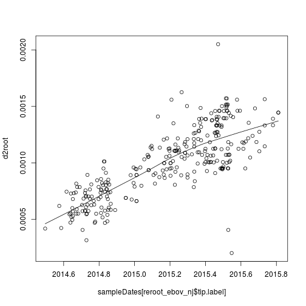
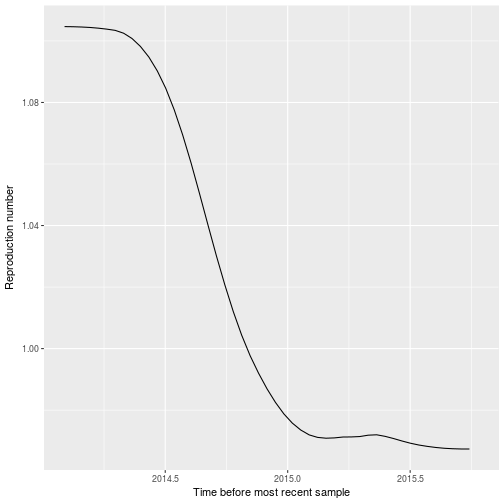

# Exploratory phylodynamics of early EBOV epidemic in Sierra Leone

In this practical, we will re-analyse whole-genome EBOV sequences collected over the course of the 2013-2015 Ebola virus epidemic in Western Africa. 
The data and analysis were first described here: 

* [Dudas G. et al.(2017) _Virus genomes reveal factors that spread and sustained the ebola epidemic_, Nature, 544/7650: 309-15.](https://dx.doi.org/10.1038%2Fnature22040)

Details of the original analysis of these data [can be found here](https://github.com/ebov/space-time/tree/master/Data)

By the way, here is an interesting TED talk by the chief scientist responsible for collecting the data: 

* [P Sabeti: How we'll fight the next deadly virus](https://www.ted.com/talks/pardis_sabeti_how_we_ll_fight_the_next_deadly_virus?language=en)

## Installation and setup
For these analyses, we'll use the `ape`, `treedater', and `skygrowth` packages. If you need to install this on MS Windows, run the installation script like this:
```
source('msc_epi_ebola_installScript.R')
```
On Mac or Linux, we will compile the packages from source:
```
install.packages('ape')
install.packages('devtools')
require(devtools)
install_github( 'mrc-ide/skygrowth')
install_github( 'emvolz/treedater')
```

Now we load the package as follows:

```r
suppressPackageStartupMessages( require(ape) )
suppressPackageStartupMessages( require(skygrowth) )
suppressPackageStartupMessages( require(treedater) )
```

## Experimental design
The original analysis by Dudas et al. was based on 1610 whole EBOV genomes. We will do a fast exploratory analysis of a random subsample of these sequences. 
In the `resamples/` directory you will find 30 replicate data sets. Each alignment (_.fas_ file) contains 300 sequences sampled at random. Corresponding to each alignment, there is also a comma-separated table which provides the time of sampling of each sequence. 

In the rest of this tutorial, we will work with the first replicate, 'resamples/aln-1.fas` and 'resamples/sts-1.csv', but you can generate your own unique results using a different replicate. 

## Loading and exploring the data
Let's load the multiple sequence alignment and inspect it:

```r
ebov_algn <- read.dna('resamples/aln-1.fas' ) 
ebov_algn
```

```
## 300 DNA sequences in binary format stored in a matrix.
## 
## All sequences of same length: 18992 
## 
## Labels:
## KG12_2015-05-27
## 13247_EMLH_2015-06-19
## 12872_EMLH_2015-04-18
## MK10173_2015-08-01
## 20140436_2014-09-03
## EM_FORE_2015_695_2015-06-07
## ...
## 
## Base composition:
##     a     c     g     t 
## 0.319 0.215 0.198 0.268
```

It's always a good idea to visually check your alignment, which is easily done using an external tool like *seaview*.
If you like, you can also do this from within R using packages such as `msaR`. Note installation and rendering will take some time. 
```
install.packages('msaR')
require(msaR)
msaR( ebov_algn )
```
This should open a browser window where you will something like the following: 


Let's compute genetic and evolutionary distances between sequences. This computes the raw number of character differences between each pair of sequences: 

```r
D_raw <- dist.dna( ebov_algn, model = 'raw' , as.matrix = T, pairwise.deletion=TRUE) * ncol(ebov_algn )
```

Note the option `pairwise.deletion=TRUE`, which causes missing data to be handled on a pairwise basis as opposed to masking sites across the entire alignment.
Let's make a histogram:
```r
diag(D_raw) <- NA # don't count zero distances on diagonal
hist(D_raw)
```

There is a lot of variation in distances, with some pairs differing by less than two characters. This is due to the short time frame over which the epidemic spread and over which samples were collected.


## A quick phylogenetic analysis and estimation of evolutionary rates

First, we will compute an evolutionary distance matrix for phylogenetic analysis. We will use the *F84* [nucleotide substition model](https://en.wikipedia.org/wiki/Models_of_DNA_evolution), which is similar to the HKY model that several published studies have found to work well for EBOV. This is different than computing the raw number of differences between sequences that we looked in the last section. The evolutionary model accounts for differential rates of substitution between different characters and also accounts for reverse-mutations and [saturation](https://en.wikipedia.org/wiki/Saturation_(genetic)).

```r
D <- dist.dna( ebov_algn, model = 'F84', pairwise.deletion=TRUE)
```

Now computing a neighbor-joining tree is as simple as the following command: 

```r
ebov_nj <- nj( D )
ebov_nj
```

```
## 
## Phylogenetic tree with 300 tips and 298 internal nodes.
## 
## Tip labels:
## 	KG12_2015-05-27, 13247_EMLH_2015-06-19, 12872_EMLH_2015-04-18, MK10173_2015-08-01, 20140436_2014-09-03, EM_FORE_2015_695_2015-06-07, ...
## 
## Unrooted; includes branch lengths.
```

Let's plot it: 

```r
plot( ladderize(ebov_nj) , show.tip.label=F) 
```


Note that there is no significance to the location of the root of this tree, and branch lengths show distances in units of substitions per site. 

To fit a molecular clock, we must use information about the time of each sample. 
Let's load the date of sampling for sequence, which is found in the following table:

```r
sampleDates_table <- read.csv( 'resamples/sts-1.csv', row.names=1 ) 
# look at the top of the file
head(sampleDates_table)
```

```
##                             sampleTimes
## KG12_2015-05-27                2015.400
## 13247_EMLH_2015-06-19          2015.463
## 12872_EMLH_2015-04-18          2015.293
## MK10173_2015-08-01             2015.581
## 20140436_2014-09-03            2014.671
## EM_FORE_2015_695_2015-06-07    2015.430
```

```r
# extract the first column: 
sampleDates <- sampleDates_table$sampleTimes
# make sure the names of this vector correspond to the names of sequences: 
names(sampleDates) <- rownames(sampleDates_table )
```

Note the unusual distribution of samples through time: 

```r
hist( sampleDates )
```


Now we can construct a time-scaled phylogenetic tree so that branches are in units of years and nodes correspond to TMRCAs. Let's start by placing the root of the tree on a branch that is likely to have the MRCA of the sample. One way to do this is to use the `rtt` command, which uses root-to-tip regression; this selects the root position to maximise the variance in evolutionary distance explained by the tree. 

```r
reroot_ebov_nj <- rtt( ebov_nj, sampleDates )
plot( ladderize(reroot_ebov_nj) , show.tip.label=FALSE )
```


Lets do our own root-to-tip regression using the rerooted tree. This will also give us a rough estimate of the molecular clock rate.
You should find an almost linear trend between when evolutionary divergence and time that the sample was taken. 

```r
# the sample size 
n <- nrow(ebov_algn ) 
# distance from root of the tree to each tip: 
d2root <- node.depth.edgelength( reroot_ebov_nj )[1:n] 
# a scatter plot with local regression line: 
scatter.smooth ( sampleDates[reroot_ebov_nj$tip.label], d2root ) 
```




Finally,we do a linear regression:

```r
summary( lm( d2root ~ sampleDates[reroot_ebov_nj$tip.label] ) )
```

```
## 
## Call:
## lm(formula = d2root ~ sampleDates[reroot_ebov_nj$tip.label])
## 
## Residuals:
##        Min         1Q     Median         3Q        Max 
## -1.064e-03 -1.242e-04  7.640e-06  1.257e-04  8.406e-04 
## 
## Coefficients:
##                                         Estimate Std. Error t value
## (Intercept)                           -1.467e+00  6.793e-02  -21.60
## sampleDates[reroot_ebov_nj$tip.label]  7.287e-04  3.371e-05   21.62
##                                       Pr(>|t|)    
## (Intercept)                             <2e-16 ***
## sampleDates[reroot_ebov_nj$tip.label]   <2e-16 ***
## ---
## Signif. codes:  0 '***' 0.001 '**' 0.01 '*' 0.05 '.' 0.1 ' ' 1
## 
## Residual standard error: 0.0001902 on 298 degrees of freedom
## Multiple R-squared:  0.6106,	Adjusted R-squared:  0.6093 
## F-statistic: 467.3 on 1 and 298 DF,  p-value: < 2.2e-16
```

Specifically, the molecular clock rate is the slope:

```r
coef( lm( d2root ~  sampleDates[reroot_ebov_nj$tip.label] ) )
```

```
##                           (Intercept) 
##                         -1.4674550612 
## sampleDates[reroot_ebov_nj$tip.label] 
##                          0.0007286956
```

This value is not very accurate, but it's in the right ball-park. Estimates based on the state-of-the-art [Bayesian methods](http://epidemic.bio.ed.ac.uk/ebolavirus_evolutionary_rates) place the rate at around `.00124` substitions per site per year.


## Estimating times of common ancestry 
To estimate a tree with branch lengths in units of time (and TMRCAs), we will use the recently-developed `treedater` R package which is based on 
*  E. M. Volz, S. D. W. Frost; [Scalable relaxed clock phylogenetic dating](https://doi.org/10.1093/ve/vex025), Virus Evolution, Volume 3, Issue 2, 1 July 2017, vex025

The `treedater` algorithm requires as input a tree with branches in units of substitutions, the sample times for each tree tip, and the length of the sequences used to estimate the tree. 
We use `treedater` like so: 

```r
# estimate the time scaled tree: 
(timetree <- dater( ebov_nj, sampleDates, s = ncol(ebov_algn) ))
```

```
## 
## Phylogenetic tree with 299 tips and 298 internal nodes.
## 
## Tip labels:
## 	KG12_2015-05-27, 13247_EMLH_2015-06-19, 12872_EMLH_2015-04-18, MK10173_2015-08-01, 20140436_2014-09-03, EM_FORE_2015_695_2015-06-07, ...
## 
## Rooted; includes branch lengths.
## 
##  Time of common ancestor 
## 2014.0889060416 
## 
##  Time to common ancestor (before most recent sample) 
## 1.72193870726051 
## 
##  Mean substitution rate 
## 0.000496960586673934 
## 
##  Strict or relaxed clock 
## relaxed 
## 
##  Coefficient of variation of rates 
## 0.504735938404942
```

Let's visualise this tree: 

```r
# the 2nd argument is the time of each sample: 
plotTreeTime( timetree, timetree$sts )
```


Does your estimated TMRCA correspond to when this epidemic originated in humans? 

## Nonparametric phylodynamic estimation 

We will reconstruct the historical dynamics of Ne(t) using the nonparametric _skygrowth_ technique. For details, see 
* Erik M. Volz, Xavier Didelot; [Modeling the Growth and Decline of Pathogen Effective Population Size Provides Insight into Epidemic Dynamics and Drivers of Antimicrobial Resistance](https://doi.org/10.1093/sysbio/syy007), Systematic Biology, syy007


```r
# make sure that the tree is the appropriate input type for skygrowth
class(timetree) <- 'phylo'
# this estimates the Ne(t) trajectory using maximum a posteriori 
sg <- skygrowth.map( timetree , tau0 = .1) 
```


```r
sg # Time is reported in years before most recent sample 
```

```
## Maximum a posteriori non parametric moving average phylodynamic model
## Effective population size bins: 50 
## Effective population size at last iteration:
##           Time       Ne
## 1  -1.72193871 2.411053
## 2  -1.68749993 2.562101
## 3  -1.65306116 2.722547
## 4  -1.61862238 2.892893
## 5  -1.58418361 3.073649
## 6  -1.54974484 3.265272
## 7  -1.51530606 3.468224
## 8  -1.48086729 3.682967
## 9  -1.44642851 3.908961
## 10 -1.41198974 4.144773
## 11 -1.37755097 4.388396
## 12 -1.34311219 4.637256
## 13 -1.30867342 4.887718
## 14 -1.27423464 5.135186
## 15 -1.23979587 5.373823
## 16 -1.20535710 5.597305
## 17 -1.17091832 5.799441
## 18 -1.13647955 5.974377
## 19 -1.10204077 6.118165
## 20 -1.06760200 6.228667
## 21 -1.03316322 6.305981
## 22 -0.99872445 6.351489
## 23 -0.96428568 6.368028
## 24 -0.92984690 6.359225
## 25 -0.89540813 6.328770
## 26 -0.86096935 6.279295
## 27 -0.82653058 6.213602
## 28 -0.79209181 6.134638
## 29 -0.75765303 6.045706
## 30 -0.72321426 5.949924
## 31 -0.68877548 5.850020
## 32 -0.65433671 5.748934
## 33 -0.61989793 5.648689
## 34 -0.58545916 5.550539
## 35 -0.55102039 5.455025
## 36 -0.51658161 5.361257
## 37 -0.48214284 5.269503
## 38 -0.44770406 5.180710
## 39 -0.41326529 5.093816
## 40 -0.37882652 5.006844
## 41 -0.34438774 4.919234
## 42 -0.30994897 4.830806
## 43 -0.27551019 4.741870
## 44 -0.24107142 4.652907
## 45 -0.20663264 4.564389
## 46 -0.17219387 4.476584
## 47 -0.13775510 4.389773
## 48 -0.10331632 4.304242
## 49 -0.06887755 4.220163
## 50 -0.03443877 4.137720
## Drift pararameter (tau):
## [1] 1.690608
```
Note that `tau0` is a smoothing parameter; feel free to increase this for smoother trajectories or decrease it for noisier trajectories. 
Let's plot on the calendar time axis

```r
# first we adjust the time axis so that is no longer years before most recent sample 
sg$time <- max(timetree$sts) + sg$time 
plot( sg , logy=FALSE)
```


According to WHO records, the epidemic peak (maximum number of cases per weak) occurred on November 28, 2014. Does your estimated time of peak Ne match that date? 

We can also use these methods to get a rough idea of how the reproduction number changed through time, because the epidemic growth rate will sometimes be similar to the growth ate of Ne. 
If we assume that the EBOV infectious period lasts 21 days on average, we can visualize R(t) like so: 

```r
R.plot( sg, gamma = 365/21 )
```


What is your estimate of the initial reproduction number R0 ? 
How does this estimate of R0 compare to other published values based on the early epidemic? 

## What next? 
If you still have time, there are many other things you can try 

* What are the effects of assuming the F84 model? What about between-site rate variation? Try different nucleotide substition models: `JC` or `TN93`, and compare `gamma=0` vs `gamma=1`
* What are the effects of the skygrowth smoothing parameter? Try values between .01 and 10
* How does the quality of your estimates change if you reduce the sample size and or remove earlier samples? Try this with the `drop.tip` command
